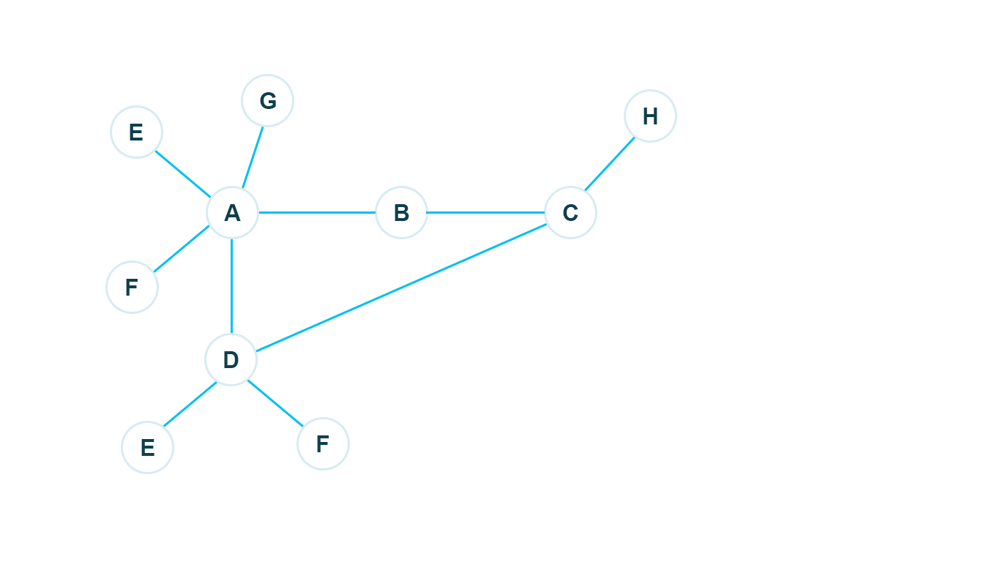

# Cycle Prevention

**Cycle:** In a mesh network _cycle_ refers to a term where a node or a sub 
network connects to another node or another sub network which is already 
connected.
 _Cycle detection is important_ because if a cycle is formed without proper 
detection mechanism then at a certain stage our network will not be able to 
expand, which causes severe hindrance for a mesh network to grow.
We adapt cycle prevention in two ways. 
**First,** whenever a connection to any node is made we maintain a list
of that node's network name (BT name or WiFi GO name). Whenever a new
eligible network is available we check our list that the particular node
is connected with that network
or not. If we find the network in our already discovered list then we
reject that network. It works before forming any physical connection. This is a 
preventive measurement. 
**Second,** This is a curing approach which works after forming a physical connection but
before logical connection. We might face three cases:  
* The node not in discovered list
* The node has a hopped or mesh connection
* The node has a direct connection

Let us check below figure.  

If the node not in the discovery list then we add it. It is true
initially for *A*, *B*, *C*, *D* and all other nodes.   

Say while *A*, *B*, *C* and *D* are connected then a new connection
between *A* and *D* happen with different interface (maybe in BT). Now
*A* will see that *D* is already in the discover list so it will update
the connection as *updated info always prioritized*. *A* will pass the
discovery info of *D* to it's earlier hopped node of *D*, which is *B*
here. Similarly *B* will continue to propagate the info.    

*C* would receive the info of *D* via *B* and update routing table
accordingly. Now, *C* will check that it had a direct connection with
*D*. So upon updating table it would issue a disconnect request (if it
can not disconnect by it's own) or disconnect immediately from that node
and keep it's additional network interface to expand network more.