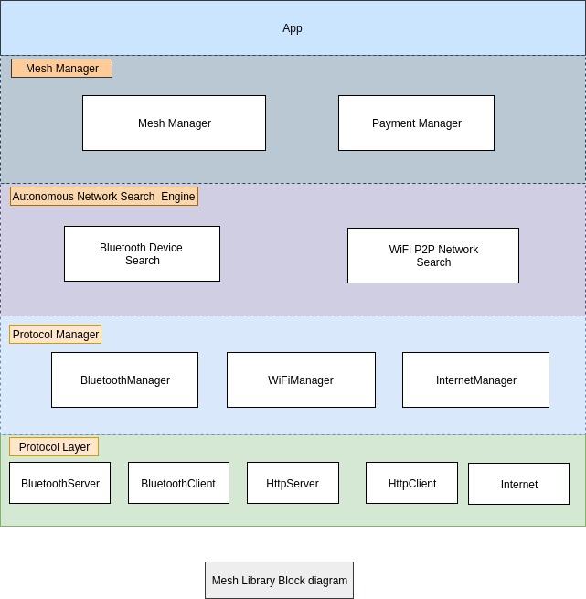
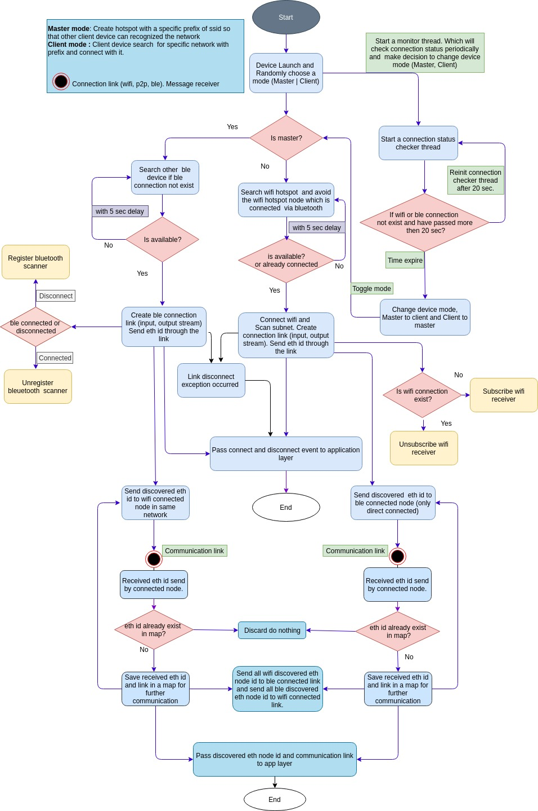
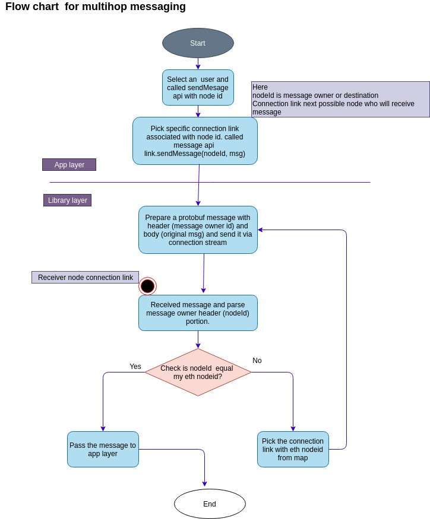

# Transport Android

Transport is an autonomous mesh networking library for Android based on WiFi, Bluetooth and WiFi Direct

This repository contains library sources, examples of using it and also short "Getting Started" guide below.

## Transport Block diagram

Block diagram represents library internal class layering. 

- App layer:

Android app that used meshLib

- Manager layer: 

Exposes some public api through app will communicate with mesh library 
- Searching and physical connectivity layer: 

Autonomous network search and device physical connectivity layer which Search Bluetooth device and P2P group to 
make device physical connection.

- Protocol Manager layer:

Protocol manager layer contains protocol specific manager class like BluetoothManager, WiFiP2PManager and InternetManager

- Protocol layer:

Low level protocol implementation like TCP, Http, Bluetooth 



# How Transport works

The Transport library has an autonomous networking layer which manages the connectivity between devices using Wi-Fi, Bluetooth and Wi-Fi direct. It does this by linking together wifi-direct group using our autonomous 
networking algorithm. In addition to helping the devices make the physical connections to each other, Transport implements a neighbour discovery protocol which allows devices to discover each other across many 
hops. As a developer you will receive events when other devices running the same app with same app ID join the network. You will also receive an event when data is received from another device running the same app as you.


### Start Transport

```
MeshTransPort meshTransPort = TransportManager.on(context).configTransport(
                                 int appId,
                                 String nodeId,
                                 LinkStateListener listener)
                                 
meshTransPort.start()
```
- Context : Application context
- appId   : int is unique for each app which is used as communication port
- nodeId  : String which is unique id for each node
- listener : LinkStateListener application needs to implement this interface to catch event from Transport mesh lib

### Stop Transport

``` 
meshTransPort.stop()
```

***Transport Application layer public api***

LinkStateListener is the interface through app will receive all kinds of event from Transport

```
/**
 * <p>App layer public interface</p>
 *
 * 1. Trigger mesh library start process from App
 * 2. Handle All discovery and messaging related call from library
 * 3. Pass node disconnect event to App
 */

public interface LinkStateListener {
    /**
     *<h1>After creating ethereum node ID library call this method</h1>
     *
     * @param nodeId : String ethereum node id
     * @param transportState : enum represent the state of meshLib
     *                       SUCCESS if library able to create or read  ID FAILED otherwise
     *
     * @param msg : String message reason if failed to start the library
     */

    void onTransportInit(String nodeId, String publicKey, TransportState transportState, String msg);

    /**
     * <p>Local user connected call back</p>
     * After found a local user this method called from library
     *
     * @param nodeId : String ID of connected node
     * @param data : byte array node info
     */
    void onLocalUserConnected(String nodeId, byte[] data);

    /**
     * <p>Other node id from different mesh network</p>
     *
     * @param nodeId : String ID of connected users
     */
    void onRemoteUserConnected(String nodeId);

    /**
     * <p>Called when connection to device is closed explicitly from either side</p>
     *  or because device is out of range.
     * @param nodeId : String disconnected node ID
     */
    void onUserDisconnected(String nodeId);

    /**
     * <p>Called when new data frame is received from remote device.</p>
     *
     * @param senderId : String message sender ID
     * @param frameData : byte array original message
     */
    void onMessageReceived(String senderId, byte[] frameData);

    /**
     * <p>Message delivered ack</p>
     *
     * @param messageId : String message sent id
     *
     * @param status : Integer{ // status of send message
     *               0 for sending
     *               1 for sent
     *               2 for delivered
     *               3 for received
     *               4 for failed }
     *
     */
    void onMessageDelivered(String messageId, int status);
}

```
***Message send api***

To send a text message to specific node needs to call below transport API

```
mTransportManager.sendMessage(String senderId,
                             String receiverId, 
                             String messageId,
                             byte[] data)
```
- senderId   : Sender unique Id (Ethereum Id)
- receiverId : Receiver unique Id (Ethereum Id)
- messageId  : Message respected Id, through which mesh lib notify app whether the message send success or failed
- data       : Actual message data at byte array format

# Transport Autonomous algorithm

## Transport User Discovery flow chart



## Transport Multihop Messaging flow chart 




# Transport License

